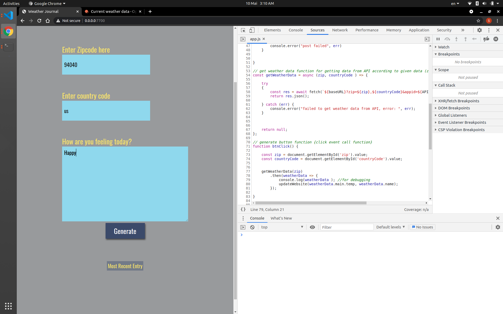
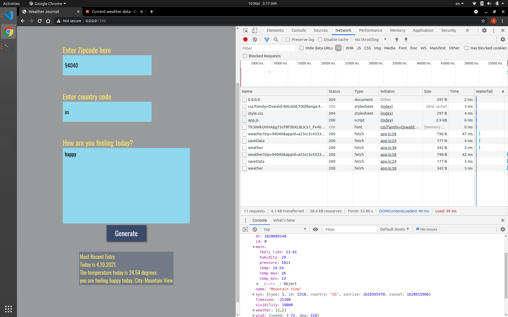

# UDACITY - FWD - Nanodegree Program

# Front end Web Development Professional

## Project name:
##- Weather-Journal App Project
## Project description

This project mission is to create an asynchronous web app that uses Web API and user data to dynamically update the UI.

##ScreenShots

## languages
HTML, CSS, Javascript

##Project features
This project is a quick practice of setting a server and routing a public API (open weather map) with your website to get info dynamically. Main practices in this proejct are:

1. API and API key
2. Async .. await functions
3. Setup a server and debugging 